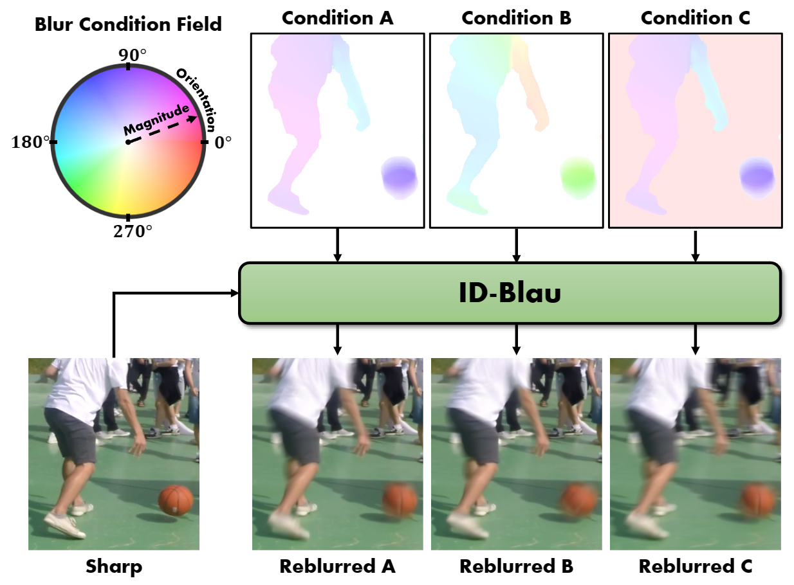
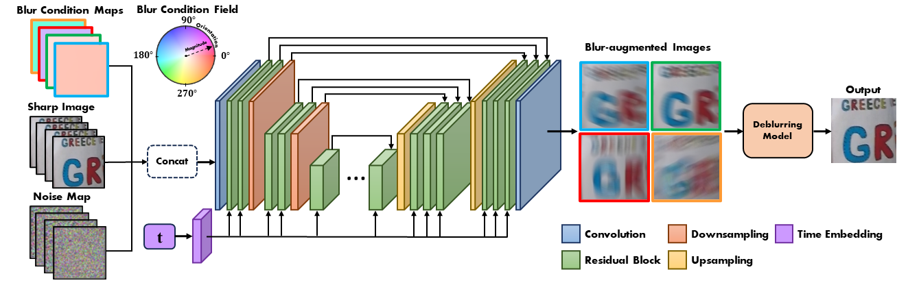
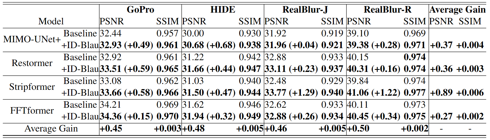

# ID-Blau: Image Deblurring by Implicit Diffusion-based reBLurring AUgmentation (CVPR 2024)
Jia-Hao Wu, Fu-Jen Tsai, Yan-Tsung Peng, Chung-Chi Tsai, Chia-Wen Lin, Yen-Yu Lin

[](https://arxiv.org/abs/2312.10998)
[](https://drive.google.com/file/d/1KO-TmSgZhG2W8jpSX1Fq_zHPf40zFmp8/view?usp=sharing)
[](https://www.youtube.com/watch?v=LoLN_Ngwq1k&ab_channel=Jia-HaoWu)


> Abstract : Image deblurring aims to remove undesired blurs from an image captured in a dynamic scene. Much research has been dedicated to improving deblurring performance through model architectural designs. However, there is little work on data augmentation for image deblurring.Since continuous motion causes blurred artifacts during image exposure, we aspire to develop a groundbreaking blur augmentation method to generate diverse blurred images by simulating motion trajectories in a continuous space. This paper proposes Implicit Diffusion-based reBLurring AUgmentation (ID-Blau), utilizing a sharp image paired with a controllable blur condition map to produce a corresponding blurred image. We parameterize the blur patterns of a blurred image with their orientations and magnitudes as a pixel-wise blur condition map to simulate motion trajectories and implicitly represent them in a continuous space. By sampling diverse blur conditions, ID-Blau can generate various blurred images unseen in the training set. Experimental results demonstrate that ID-Blau can produce realistic blurred images for training and thus significantly improve performance for state-of-the-art deblurring models.



## Framework



## Installation

```
conda create -n IDBlau python=3.9
conda activate IDBlau
conda install pytorch==1.13.1 torchvision==0.14.1 torchaudio==0.13.1 pytorch-cuda=11.7 -c pytorch -c nvidia
pip install opencv-python tqdm tensorboardX pyiqa thop
```

## ID-Blau

Pytorch Implementation of ID-Blau.

### Required Data

#### Download GoPro Dataset

To generate blur condtion for GoPro dataset, you will need to download the required datasets.
You can download from the original website on [GoPro website](https://seungjunnah.github.io/Datasets/gopro.html).

- [GOPRO_Large_all](https://seungjunnah.github.io/Datasets/gopro.html)
- [GOPRO_Large](https://seungjunnah.github.io/Datasets/gopro.html)

The GOPRO_Large_all dataset is exclusively used for RAFT to calculate blur conditions and will not be employed for training in ID-Blau.

```Shell
├── ID-Blau
    ├── dataset
        ├── GOPRO_Large_all
            ├── test
            ├── train
        ├── GOPRO_Large
            ├── test
            ├── train
```

#### Preparing Blur Condition

it's essential to generate a dataset with the specified blur conditions.
We use
[RAFT: Recurrent All Pairs Field Transforms for Optical Flow](https://arxiv.org/pdf/2003.12039.pdf) to esimate flow optical.

You can download [GOPRO_flow](https://1drv.ms/f/s!Ak-XvKng9zmfg8dmkkNz-GyYjBHiWw?e=e8RO3k) dataset

or

Run the code to generate blur condtions.

```Shell
cd PrepareCondition
python generate_condition.py --mode all --model=weights/raft-things.pth --dir_path=../dataset/GOPRO_flow
cd ..
```

### Generating Reblur Dataset

We have provided pretrained models (ID_Blau.pth) under the "./weights" path.

```
CUDA_VISIBLE_DEVICES=0 python diffusion_inference.py --model_path ./weights/ID_Blau.pth --dir_path ./dataset/GOPRO_Large_Reblur --strategy M10 O TURN
```

The generated blurry dataset will be located in the "./dataset/GOPRO_Large_Reblur" directory.

### Training

Run the following command.

```
CUDA_VISIBLE_DEVICES=0,1,2,3 python diffusion_train.py
```

## Deblurring Model

### Training

The detailed training instructions for each model are provided in the README file located within the folder named after each respective model.

- [MIMO_UNetPlus](MIMO_UNet/README.md)
- [Restormer](Restormer/README.md)
- [Stripformer](Stripformer/README.md)
- [FFTformer](FFTformer/README.md)

### Testing

#### Required Data

The test dataset structure follows the configuration of [Restormer](https://github.com/swz30/Restormer), and datasets (GoPro、HIDE、RealBlur_J、RealBlur_R) can be downloaded through [their github](https://github.com/swz30/Restormer/tree/main/Motion_Deblurring).

The dataset is structured as follows:

```
├── dataset
    ├── test
        ├── GoPro
            ├── input
                ├── image1.png
                ├── image2.png
            ├── target
                ├── image1.png
                ├── image2.png
        ├── HIDE
            ├── input
                ├── image1.png
                ├── image2.png
            ├── target
                ├── image1.png
                ├── image2.png
        ├── RealBlur_J
            ├── input
                ├── image1.png
                ├── image2.png
            ├── target
                ├── image1.png
                ├── image2.png
        ├── RealBlur_R
            ├── input
                ├── image1.png
                ├── image2.png
            ├── target
                ├── image1.png
                ├── image2.png
```

#### Weights

To reproduce the results of each model, please download the corresponding model parameters based on different models and datasets.

- **You can find all the model weights at [ID-Blau Weights](https://drive.google.com/drive/folders/1HUXGnC0SbsS5YCs_jjnelRmiVN_-oGGP?usp=drive_link)**.
    - [MIMO_UNetPlus Weights](https://drive.google.com/drive/folders/1Bc808KGv49NXXSB50cKq9_uH8SdEGGs4?usp=drive_link)
    - [Restormer Weights](https://drive.google.com/drive/folders/1ujPMfrc33abnq8Ecnpds684_SlKgVsot?usp=drive_link)
    - [Stripformer Weights](https://drive.google.com/drive/folders/1j-htUrnBon5RRzfVcQwg-ZiNy7CZlsqb?usp=drive_link)
    - [FFTformer Weights](https://drive.google.com/drive/folders/1Wq23p17ojruQdWhx-5X6Iq56lSxRAUjF?usp=drive_link)

The downloaded models should be placed in the "./weights" directory.

#### Inference

Please note that the following command requires replacing the parameters according to the model name and the dataset you intend to predict:

```
CUDA_VISIBLE_DEVICES=0 python ./{MODEL}/deblur_predict.py --dataset {DATASET_NAME} --model_path ./weights/{MODEL_NAME}.pth
```

This command has three parameters:

1. `MODEL`: The folder name of the model.
2. `DATASET_NAME`: The name of the dataset you want to use.
3. `MODEL_NAME`: The name of the specific model you're working with.

Remember to replace "{`MODEL`}", "{`DATASET_NAME`}", and "{`MODEL_NAME`}" with the actual names relevant to your setup.
Here's an example based on the provided command:

```
CUDA_VISIBLE_DEVICES=0 python ./Stripformer/deblur_predict.py --dataset RealBlur_J --model_path ./weights/Stripformer_RealBlur_J.pth
```

### Evalation

#### GoPro and HIDE

To evaluate results from GoPro and HIDE in MATLAB, you can run the following code.

```
eval_GoPro_HIDE.m
```

Please remember to change the model and datasets variables according to your specific needs before executing the code.

#### RealBlur_J and RealBlur_R

To evaluate results from RealBlur_J and RealBlur_R, you can run the following code.

```
python eval_realblur.py --out_path 'out/{FOLDER_NAME}/results/{DATASET_NAME}' --gt_path 'dataset/test/{DATASET_NAME}/target'
```

This command has three parameters:

1. `FOLDER_NAME`: The folder name of the result you want to evaluate.
2. `DATASET_NAME`: The name of the dataset you want to use(RealBlur_J or RealBlur_R).

Remember to replace "{`FOLDER_NAME`}" and "{`DATASET_NAME`}"with the actual names relevant to your setup.
Here's an example based on the provided command:

```
python eval_realblur.py --out_path 'out/Stripformer/results/RealBlur_J' --gt_path 'dataset/test/RealBlur_J/target'
```

## Results

We compare the deblurring performance of four baselines and their ID-Blau-powered versions in Table, where `Baseline` and `+ID-Blau` denote the deblurring performance without and with ID-Blau, respectively.
Experimental results have shown that ID-Blau can significantly improve the performance of state-of-the-art deblurring models.



## Acknowledgment

For this project, we incorporate segments of code from:

- [RAFT](https://github.com/princeton-vl/RAFT)
- [MIMO_UNet](https://github.com/chosj95/MIMO-UNet)
- [Restormer](https://github.com/swz30/Restormer)
- [Stripformer](https://github.com/pp00704831/Stripformer-ECCV-2022-)
- [FFTformer](https://github.com/kkkls/FFTformer)

## Citation

```
@InProceedings{Wu_2024_IDBlau,
    author    = {Wu, Jia-Hao and Tsai, Fu-Jen and Peng, Yan-Tsung and Tsai, Chung-Chi and Lin, Chia-Wen and Lin, Yen-Yu},
    title     = {ID-Blau: Image Deblurring by Implicit Diffusion-based reBLurring AUgmentation},
    booktitle = {Proceedings of the IEEE/CVF Conference on Computer Vision and Pattern Recognition (CVPR)},
    month     = {June},
    year      = {2024},
    pages     = {25847-25856}
}
```
